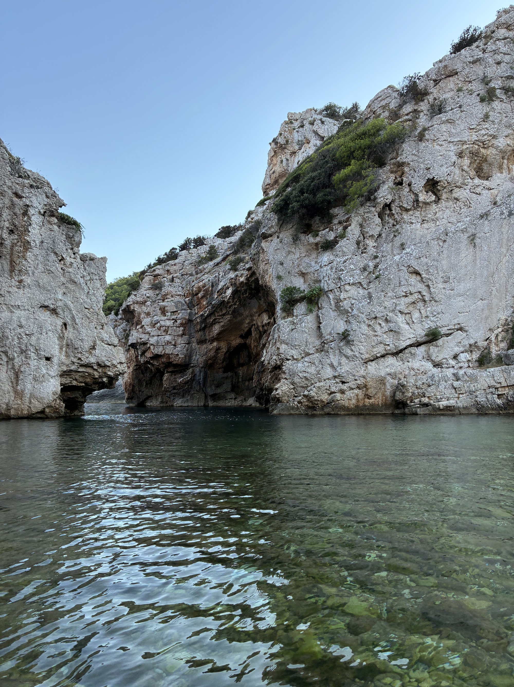

# Il nostro diario di viaggio 🌊

Il sito del vostro diario di viaggio — Ema & Viti, Croazia 2026.
Tutto qui dentro è un file di testo semplice: nessuna piattaforma, nessun account
da pagare, nessuna dipendenza esterna (anche i font sono inclusi nella cartella
`fonts/`). Finché avete questi file, avete il sito.

## Come metterlo online (5 minuti, nessun comando da digitare)

1. Andate su [github.com/new](https://github.com/new) e create un repository.
   Chiamatelo per esempio `diario-croazia`. **Non** spuntate "Add a README" —
   deve restare vuoto.
2. Nella pagina del repository appena creato, cliccate **"uploading an
   existing file"**.
3. Trascinate dentro *tutti* i file e le cartelle che trovate qui
   (`index.html`, `README.md`, la cartella `fonts/`, la cartella `assets/`) e
   confermate il commit.
4. Andate su **Settings → Pages**, alla voce "Branch" scegliete `main` e
   cartella `/ (root)`, salvate.
5. Dopo un minuto o due, il sito sarà online su
   `https://<vostro-nome-utente>.github.io/diario-croazia/`.

Se preferite usare il terminale invece del trascinamento, i comandi sono:

```
cd diario-vis
git init
git add .
git commit -m "Diario di bordo — versione iniziale"
git branch -M main
git remote add origin https://github.com/<vostro-utente>/diario-croazia.git
git push -u origin main
```

## Come aggiungere una nuova giornata

Aprite `index.html` con un qualsiasi editor di testo (anche Blocco Note o
TextEdit vanno bene), cercate l'ultimo blocco `<!-- GIORNO 12 -->` e
incollate subito dopo la sua chiusura (`</div>` finale di quel giorno) un
blocco come questo, cambiando numero, data e voti:

```html
<div class="day" id="g13">
  <div class="stamp">13</div>
  <div class="day-head">
    <div class="day-date">13 Agosto</div>
    <div class="day-place">Vis, Croazia</div>
  </div>

  <div class="photos">
    <div class="photo-slot">📷 aggiungi foto</div>
    <div class="photo-slot">📷 aggiungi foto</div>
    <div class="photo-slot">📷 aggiungi foto</div>
  </div>

  <div class="card">
    <div class="card-top">
      <div><div class="format-label">Quattro Ristoranti</div><div class="venue-name">NOME RISTORANTE</div></div>
      <div class="overall"><div class="num" data-overall></div><div class="lbl">media</div></div>
    </div>
    <div class="rows" data-rows='[
      {"label":"Location","ema":0,"viti":0},
      {"label":"Menù — offerta","ema":0,"viti":0},
      {"label":"Menù — scelta","ema":0,"viti":0},
      {"label":"Servizio","ema":0,"viti":0},
      {"label":"Conto","ema":0,"viti":0}
    ]'></div>
  </div>

  <div class="card">
    <div class="card-top beach">
      <div><div class="format-label">Quattro Spiagge</div><div class="venue-name">NOME SPIAGGIA</div></div>
      <div class="overall"><div class="num" data-overall></div><div class="lbl">media</div></div>
    </div>
    <div class="rows" data-rows='[
      {"label":"Strada per arrivare","ema":0,"viti":0},
      {"label":"Spiaggia (mare)","ema":0,"viti":0},
      {"label":"Ambiente — paesaggio","ema":0,"viti":0},
      {"label":"Ambiente — persone","ema":0,"viti":0},
      {"label":"Servizi","ema":0,"viti":0}
    ]'></div>
  </div>

  <div class="journal-slot">Scrivete qui due righe sulla giornata, quando volete.</div>
</div>
```

Aggiungete anche un link nella barra in alto (`<nav class="quicknav">`):
`<a href="#g13">13 Ago</a>`.

Un voto con la virgola (es. 7,75) va scritto con il punto: `7.75`.
Per aggiungere una nota a una singola voce, aggiungete `,"note":"il vostro testo"`
dentro le graffe di quella voce.

## Come aggiungere le foto

Mettete le foto nella cartella `assets/photos/` (nomi tipo `giorno11-1.jpg`),
poi nel giorno corrispondente sostituite un blocco così:

```html
<div class="photo-slot">📷 aggiungi foto</div>
```

con:

```html

```

## Struttura dei file

```
diario-vis/
├── index.html          → l'intero sito, una sola pagina
├── README.md            → questo file
├── fonts/                → i tre font usati, inclusi nel repository
└── assets/photos/        → dove mettere le foto
```

## Nota su GitHub

Non ho un modo per collegarmi al vostro account GitHub direttamente (per
sicurezza, non gestisco credenziali o token di accesso all'interno della
chat) — da qui la procedura di caricamento manuale sopra, che richiede
davvero solo qualche clic.
